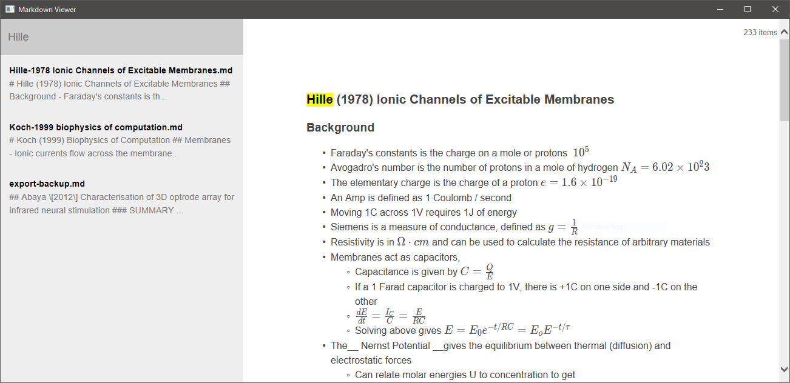

# Markdown Browser

This is a bit of a test project, designed to try out an alternative to Electron and learn a bit of Rust.

Basically you drop it in the directory where you have a lot of markdown files. The left hand side will
display a list of all the files in the directory, and you can click on them to view the rendered output
in a `web-view`. You can filter from the titles or contents of the files.

It is working, but I wouldn't rely on it for anything critical!

## BUILDING

I'm not planning to provide any binaries. To build it you need rust/cargo and run

    cargo build --release

**NOTE** If you omit the release flag it will try to load from a random location where I store my Markdown files.
Later on I may allow setting the browser directory using a config file, but that's not going to happen
any time soon!

## LICENSE

This project is licensed under either of

Apache License, Version 2.0, (see LICENSE-APACHE or http://www.apache.org/licenses/LICENSE-2.0)
MIT license (see LICENSE-MIT or http://opensource.org/licenses/MIT)
at your option.